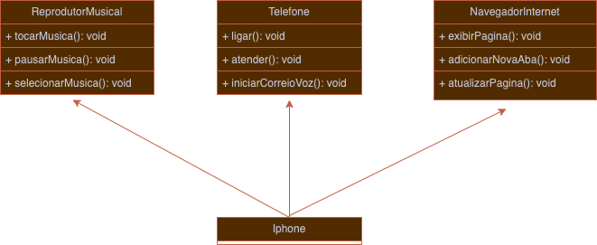

# Desafio de diagramação UML 
#### [DIO](https://web.dio.me/home) + [Santander Open Academy](https://www.santanderopenacademy.com/en/index.html).

Este desafio foi realizado com o intuito de fixar o conteúdo estudado no módulo de introdução à Programação Orientada a Objetos em Java, além da diagramação utilizando UML.

## 📱 Em que consiste o desafio?
- O desafio consiste em construir um diagrama UML com base na apresentação de lançamento do iPhone de 2007, considerando as funções de reprodutor musical, telefone e navegador de internet.
- Além disso, foi necessário colocar tais informações em código, a fim de estruturar o uso de interface e criação de objetos.

## 📊 Diagrama UML

  

